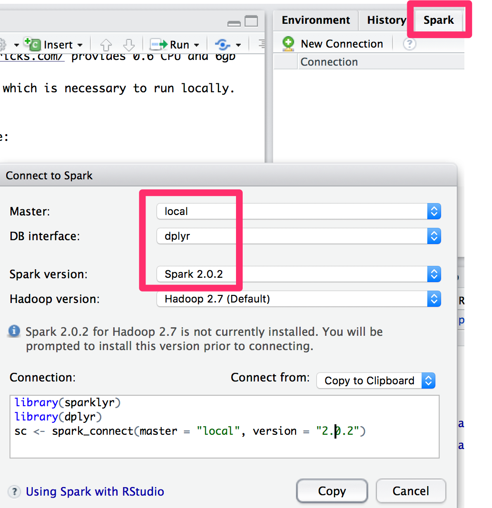

This lab is part of [R Summer School](http://rsummer.data-analysis.at) for the talk R for HPC and big data.
It is partly based on http://spark.rstudio.com, https://blog.cloudera.com/blog/2016/09/introducing-sparklyr-an-r-interface-for-apache-spark and http://www.win-vector.com/blog/2017/07/working-with-r-and-big-data-use-replyr/.

You can run the lab on yor laptop. If you want to use a cloud environment https://community.cloud.databricks.com/ provides 0.6 CPU and 6gb RAM for free but requires some additional R packages if you want to use it from a local Rstudio. If you completely want to use the cloud https://databricks.com/blog/2017/05/25/using-sparklyr-databricks.html should be a good start.
This guide covers everything which is necessary to run locally. Otherwise if you want to use a local RStudio installation the file `cloud.Rmd` partially covers how to set things up.

## step 0 - prerequesites
install the following software:

- Rstudio https://www.rstudio.com/products/RStudio/
- R https://cran.r-project.org

## step 1 - installation
We will install a couple of packages. If you want to use the latest features feel free to directly install from github and not from CRAN:

```{r, eval=FALSE, include=TRUE}
install.packages(c("devtools", "tidyverse", "replyr"))
# devtools::install_github("hadley/tidyverse") # not mandatory to have the latest features here.
devtools::install_github("rstudio/sparklyr",lib="")

# some data to analyze later on
install.packages(c("nycflights13", "Lahman"))
```

## step 2 - start a (local) spark cluster
Either start /connect to the spark master from the GUI
 or execute the following code:

```{r, echo=TRUE}
library(sparklyr)
suppressPackageStartupMessages(library("dplyr"))
library(nycflights13)
library(Lahman)
```
on the first run you also must download spark. First check for available versions

```{r, eval=FALSE, include=TRUE}
spark_available_versions()
```

then install the latest version. Currently, this is `2.2.0`

```{r, eval=FALSE, include=TRUE}
spark_install(version = "2.2.0", hadoop_version = "2.7")
```
then connect:
```{r}
# local spark
spark <- spark_connect(master = "local", version = "2.1.1")

# cloud spark https://databricks.com/blog/2017/05/25/using-sparklyr-databricks.html
# spark <- spark_connect(method = "databricks") # that also requires sparkR to be installed
```

to view sparks web interface:
```{r, eval=FALSE, include=TRUE}
sparklyr::spark_web(spark)
```

## lab

### exercise 1 - dplyr interface to sparkSQL:

- copy data from R to spark, i.e. you can choose a dummy data set like the iris data set (`iris`)
- create a second spark data frame with the flights nycflights13 dataset as flights (`nycflights13::flights`)
- create a third data frame with the batting data set (`Lahman::Batting`). However this time we want to read it as a CSV. Write the CSV first to a local file, than read it to spark.

```{r}
iris_tbl <- copy_to(spark,iris)
flights_tbl<-copy_to(spark,nycflights13::flights,"flights")

write.csv2(Lahman::Batting, file = "batting.csv", row.names = FALSE)
batting_tbl <- spark_read_csv(spark, "batting", "batting.csv", header = TRUE,
                              infer_schema = TRUE, delimiter = ",", quote = "\"", escape = "\\",
                              charset = "UTF-8", null_value = "NA", options = list(),
                              repartition = 2, memory = TRUE, overwrite = TRUE)
batting_tbl <- copy_to(spark,Lahman::Batting,"batting")
```
show all spark data frames i.e. tables
```{r}
src_tbls(spark)
```

filter the flights table by `departue delay == 2`
```{r}
flights_tbl%>%filter(dep_delay==2)
```
### exercise 2 - dplyr in action

- group fligths by tail_num
- aggregate by `count(*)`, mean distance as `dist`, mean delay as delay
- where `count>20` and `dist<2000` and `delay is not null`
```{r}
delay <- flights_tbl %>% group_by(tailnum) %>% summarise(
  count = n(),
  dist = mean(distance),
  delay = mean(arr_delay)
) %>% filter(count > 20,
             dist <
               2000,!is.na(delay)) %>% collect()
head(delay)
```
plot the results

- create a scatterplot of results of `dist` and `delay`
- include a regression line
```{r}
library(ggplot2)
ggplot(
  delay,aes(dist,delay))+
  geom_point(aes(size=count),alpha=1/2)+ geom_smooth()+ scale_size_area(max_size=2)
```

### exercise 3 - use plain sql
you can also query the spark table via plain sql queries. Use `DBI` which is also the SQL backend of `dplyr`.
```{r}
library(DBI) 
iris_preview <- dbGetQuery(spark, "SELECT * FROM iris LIMIT 10")
iris_preview
```

### exercise 4 - simple machine learning LM
- some of sparks ML functionality is accessible
- additionally h20.ai`s `rsparkling` provides ML methods on top of `sparklyR`

- load the mtcars dataset to spark
- create a train / test split with 50% of the data
- create a feature which is binary and `TRUE` if `cyl == 8`
- fit a simple LM model with `mpg` as response and `wt`and `cyl`as features
- print the summary of the linear model

```{r}
# copy mtcars into spark
mtcars_tbl <- copy_to(spark, mtcars)

# transform our data set, and then partition into 'training', 'test'
partitions <- mtcars_tbl %>%
  filter(hp >= 100) %>%
  mutate(cyl8 = cyl == 8) %>%
  sdf_partition(training = 0.5, test = 0.5, seed = 1099)

# fit a linear model to the training dataset
fit <- partitions$training %>%
  ml_linear_regression(response = "mpg", features = c("wt", "cyl"))

summary(fit)
```
Finally, stop the spark session:
```{r}
spark_disconnect(spark)
```

### exercise 5 - apply tidyR to spark data frames
Let's add `replyr` to the mix. This acronym stands for: REmote PLYing of big data for R. It lets you take a number of common working patterns and apply them to remote data, i.e. makes packages like `tidyR` compatible with spark.

For this excercise make sure to use the latest (dev) versions of sparklyr. 

Load replyr:
```{r}
library(replyr)
```


Start spark with custom configuration which allows for more memory:
```{r}
# more memory as suggested in https://github.com/rstudio/sparklyr/issues/783
config <- spark_config()
config[["sparklyr.shell.driver-memory"]] <- "4G"
spark <- sparklyr::spark_connect(version='2.1.1', 
                                 hadoop_version = '2.7',
                                 master = "local",
                                 config = config)
```

create a spark dataframe from mtcars and compute the summary:
```{r}
mtcars_spark <- copy_to(spark, mtcars)
# gives summary of handle, not data
summary(mtcars_spark)

# replyr_summary works
replyr_summary(mtcars_spark)
replyr_summary(mtcars_spark) %>%
  select(-lexmin, -lexmax, -nunique, -index)
```

use tidyverse to cleanup the data set. The index contains the names of the cars. Create an additional column to cleanly hold the properties of the index
```{r}
mtcars
mtcars %>%
  mutate(car = row.names(mtcars))
```

When adding spark into the mix the *standard* tidyR code will fail in the beginning:
```{r}
mtcars2 <- mtcars %>%
  mutate(car = row.names(mtcars)) %>%
  copy_to(spark, ., 'mtcars2')

# errors out
mtcars2 %>% 
  tidyr::gather('fact', 'value')
```

but with replyr this can be handled:
```{r}
mtcars2 %>%
  replyr_moveValuesToRows(nameForNewKeyColumn= 'fact', 
                          nameForNewValueColumn= 'value', 
                          columnsToTakeFrom= colnames(mtcars),
                          nameForNewClassColumn= 'class') %>%
  arrange(car, fact)
```

These additional functionality might be integrated directly into sparklyr in the future.

### exercise 6 - apply function to each group
Assume you have a big data set and for each group you want to compute an aggregation. In general this is rather easy via sparklyr or the sql api. However, when you want to fit a model, i.e. a more complex and non standard aggregation it gets a bit more complicated.
With standard sparklr this does not yet work: https://github.com/rstudio/sparklyr/issues/770 If you were using native (java, scala) spark you could write a custom UADF. This is not possible from R.
sparkR however offers `gapply` to handle working with groups. 

With replyr there is a new possibility to integrate the functionality of `gapply` into sparklyr. **dplyr::do** for local data is made compatible with spark.

The sample takes a few rows from each group of a grouped data set.
```{r}
by_cyl <- group_by(mtcars, cyl)
do(by_cyl, head(., 2))
```

Let's apply this pattern to spark:
```{r}
by_cyl <- group_by(mtcars_spark, cyl)
do(by_cyl, head(., 2))
```
But as you see the result is not really useful.
With replyr this is possible:

```{r}
mtcars_spark %>%
  replyr_split('cyl', 
               partitionMethod = 'extract') %>%
  lapply(function(di) head(di, 2)) %>%
  replyr_bind_rows()

mtcars_spark %>%
  gapply('cyl',
         partitionMethod = 'extract',
         function(di) head(di, 2))
```


> Note: accoring to microsoft, their (commercial R Version) https://blogs.msdn.microsoft.com/rserver/2017/05/04/performance-rxexecby-vs-gapply-on-spark/ offers better performance for such operations

To conclude the lab let's stop spark
```{r}
spark_disconnect(spark)
```
